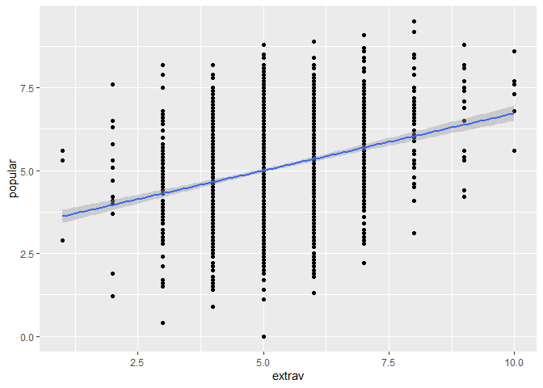
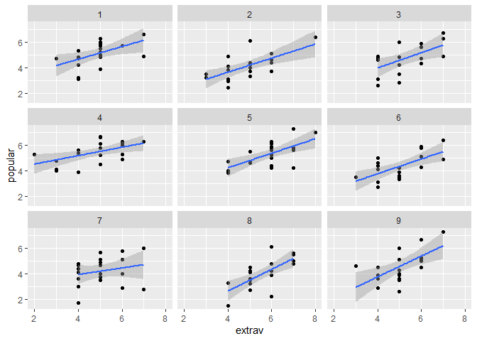
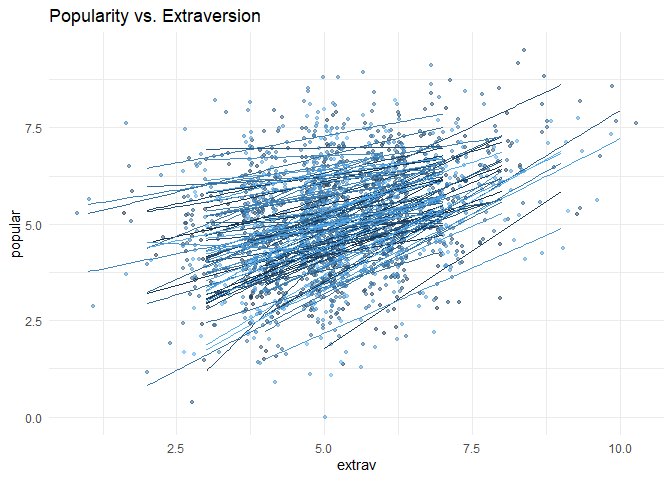

Portfolio1: MLM
================
Yoo Ri Hwang
1/15/2022

# Source

<https://stat.utexas.edu/images/SSC/documents/SoftwareTutorials/MultilevelModeling.pdf>

<https://cehs-research.github.io/eBook_multilevel/mlm-2-levels-pupil-popularity.html>

I refer the code on these websites. I followed the general tutorials
instructed on these website.

However, I made some changes. (I do some extra analysis that was not on
the website etc. ) I also explained by myself.

### notification

ICC calculated based on the null model.

# Prepare

## load library

``` r
library(foreign)
library(tidyverse)
library(haven)    
library(furniture)    
#install.packages('furniture')
library(stargazer)    
library(texreg)   
#install.packages('texreg')
library(gridExtra)    
#install.packages('gridExtra')
library(psych)        
library(car)      
#install.packages('car')
library(nlme)
library(lme4)         
library(lmerTest)     
library(optimx)
#install.packages('optimx')
# oh my gosh this never ends. 

# packages <- c('performance','interactions','HLMdiag','sjstats')
# 
# installed_packages <- packages %in% rownames(installed.packages())
# if (any(installed_packages == FALSE)) {
#   install.packages(packages[!installed_packages])
# }


#devtools::install_github("goodekat/redres")

library(performance)  
library(interactions) 
library(HLMdiag)      
library(redres)       
library(sjstats)     
library(predict3d)
```

## load data

``` r
data_raw <- haven::read_sav("https://github.com/MultiLevelAnalysis/Datasets-third-edition-Multilevel-book/raw/master/chapter%202/popularity/SPSS/popular2.sav")

summary(data_raw)
```

    ##      pupil           class            extrav            sex        
    ##  Min.   : 1.00   Min.   :  1.00   Min.   : 1.000   Min.   :0.0000  
    ##  1st Qu.: 6.00   1st Qu.: 25.00   1st Qu.: 4.000   1st Qu.:0.0000  
    ##  Median :11.00   Median : 51.00   Median : 5.000   Median :1.0000  
    ##  Mean   :10.65   Mean   : 50.37   Mean   : 5.215   Mean   :0.5055  
    ##  3rd Qu.:16.00   3rd Qu.: 76.00   3rd Qu.: 6.000   3rd Qu.:1.0000  
    ##  Max.   :26.00   Max.   :100.00   Max.   :10.000   Max.   :1.0000  
    ##       texp          popular         popteach         Zextrav       
    ##  Min.   : 2.00   Min.   :0.000   Min.   : 1.000   Min.   :-3.3390  
    ##  1st Qu.: 8.00   1st Qu.:4.100   1st Qu.: 4.000   1st Qu.:-0.9625  
    ##  Median :15.00   Median :5.100   Median : 5.000   Median :-0.1703  
    ##  Mean   :14.26   Mean   :5.076   Mean   : 5.061   Mean   : 0.0000  
    ##  3rd Qu.:20.00   3rd Qu.:6.000   3rd Qu.: 6.000   3rd Qu.: 0.6218  
    ##  Max.   :25.00   Max.   :9.500   Max.   :10.000   Max.   : 3.7905  
    ##       Zsex             Ztexp            Zpopular          Zpopteach       
    ##  Min.   :-1.0108   Min.   :-1.8717   Min.   :-3.67188   Min.   :-2.89165  
    ##  1st Qu.:-1.0108   1st Qu.:-0.9559   1st Qu.:-0.70628   1st Qu.:-0.75523  
    ##  Median : 0.9888   Median : 0.1125   Median : 0.01703   Median :-0.04308  
    ##  Mean   : 0.0000   Mean   : 0.0000   Mean   : 0.00000   Mean   : 0.00000  
    ##  3rd Qu.: 0.9888   3rd Qu.: 0.8756   3rd Qu.: 0.66802   3rd Qu.: 0.66906  
    ##  Max.   : 0.9888   Max.   : 1.6388   Max.   : 3.19962   Max.   : 3.51762  
    ##     Cextrav           Ctexp              Csex        
    ##  Min.   :-4.215   Min.   :-12.263   Min.   :-0.5000  
    ##  1st Qu.:-1.215   1st Qu.: -6.263   1st Qu.:-0.5000  
    ##  Median :-0.215   Median :  0.737   Median : 0.5000  
    ##  Mean   : 0.000   Mean   :  0.000   Mean   : 0.0055  
    ##  3rd Qu.: 0.785   3rd Qu.:  5.737   3rd Qu.: 0.5000  
    ##  Max.   : 4.785   Max.   : 10.737   Max.   : 0.5000

data structure:

pupils are nested in the class. trying to predict popluarity of pupil by
pupil’s gender and extravert. Furthermore, teacher’s experience
(class-level variable) will be considered.

To sum up, we have

Level-1 IV: pupil gender (SEX): coded as boy=0, girl=1  
Pupil’s extroversion (extrav) : 10-point scale.

Level-2IV: teacher’s experience (texp)

subsetting the data

``` r
# we only take what we need

data_pop <- data_raw %>%
  dplyr::mutate(id = paste(class,pupil, sep = "-") %>% #creating uniqe ids for student 
                  factor()) %>%
  dplyr::select(id,pupil:popteach)

tibble::glimpse(head(data_pop,10))
```

    ## Rows: 10
    ## Columns: 8
    ## $ id       <fct> 1-1, 1-2, 1-3, 1-4, 1-5, 1-6, 1-7, 1-8, 1-9, 1-10
    ## $ pupil    <dbl> 1, 2, 3, 4, 5, 6, 7, 8, 9, 10
    ## $ class    <dbl> 1, 1, 1, 1, 1, 1, 1, 1, 1, 1
    ## $ extrav   <dbl> 5, 7, 4, 3, 5, 4, 5, 4, 5, 5
    ## $ sex      <dbl+lbl> 1, 0, 1, 1, 1, 0, 0, 0, 0, 0
    ## $ texp     <dbl> 24, 24, 24, 24, 24, 24, 24, 24, 24, 24
    ## $ popular  <dbl> 6.3, 4.9, 5.3, 4.7, 6.0, 4.7, 5.9, 4.2, 5.2, 3.9
    ## $ popteach <dbl> 6, 5, 6, 5, 6, 5, 5, 5, 5, 3

check our fancy data

``` r
data_pop %>%
  dplyr::select(extrav, sex, texp, popular) %>%
  data.frame() %>%
  stargazer::stargazer(header=F,type="text")
```

    ## 
    ## =============================================================
    ## Statistic   N    Mean  St. Dev.  Min  Pctl(25) Pctl(75)  Max 
    ## -------------------------------------------------------------
    ## extrav    2,000 5.215   1.262     1      4        6      10  
    ## sex       2,000 0.505   0.500     0      0        1       1  
    ## texp      2,000 14.263  6.552     2      8        20     25  
    ## popular   2,000 5.076   1.383   0.000  4.100    6.000   9.500
    ## -------------------------------------------------------------

## simple plots

1.  when we overlook nested structure

``` r
data_pop %>%
  ggplot() +
  aes(x = extrav, y = popular)+ 
  geom_point()+
  stat_smooth(method=lm)
```

    ## `geom_smooth()` using formula 'y ~ x'

<!-- --> 2. consider
cluster (group)

just for curious, we pick first 9 class and see

``` r
data_pop %>%
  dplyr::filter(class<=9)%>%
  ggplot() +
  aes(x = extrav, y = popular)+ 
  geom_point()+
  stat_smooth(method=lm)+
  facet_wrap(~ class) 
```

    ## `geom_smooth()` using formula 'y ~ x'

<!-- --> 3.

``` r
ggplot(data      = data_pop,
       aes(x     = extrav,
           y     = popular,
           col   = class,
           group = class)) + 
  geom_point(size     = 1,
             alpha    = .5,
             position = "jitter") +
  theme_minimal() +
  theme(legend.position = "none") +
     geom_smooth(method = lm,
              se     = FALSE,
              size   = .5, 
              alpha  = .8)+ # to add regression line
  labs(title    = "Popularity vs. Extraversion")
```

<!-- --> This code (for
third graph) was adpated from
“<https://www.rensvandeschoot.com/tutorials/lme4/>”

## Centering

In the tutorial website, the author did not do the centering and keep
analyzing. However, in most cases, it is not useful unless it has
certian theoritical reasons.

``` r
#install.packages('misty')
library(misty)
```

    ## |-------------------------------------|
    ## | misty 0.4.3 (2021-09-30)            |
    ## | Miscellaneous Functions T. Yanagida |
    ## |-------------------------------------|

``` r
#center level-1 predictor at the grandmean
data_pop$cgm_extrav<-misty::center(data_pop$extrav)
data_pop$cgm_sex<-misty::center(data_pop$sex)
data_pop$cgm_texp<-misty::center(data_pop$texp)

#center level-1 predictor at the clustermean
data_pop$cwc_extrav<-misty::center(data_pop$extrav, type="CWC", cluster = data_pop$class)
data_pop$cwc_sex<-misty::center(data_pop$sex, type="CWC", cluster = data_pop$class)
```

## Single-level equation (regression)

*P**O**P*<sub>*i**j*</sub> = *β*<sub>0</sub> + *β*<sub>1</sub>*S**E**X*<sub>*i**j*</sub> + *β*<sub>2</sub>*E**X**T*<sub>*i**j*</sub> + *e*<sub>*i**j*</sub>
Random parameter: *v**a**r*\[*e*<sub>*i**j*</sub>\]  
fixed: intercept, slopes.

I won’t check the interaction at this point. This single-level
regression is rediculous in that it ignore nonindependenc.

``` r
pop_lm<- lm(popular ~ sex + extrav, data = data_pop) 

summary(pop_lm)
```

    ## 
    ## Call:
    ## lm(formula = popular ~ sex + extrav, data = data_pop)
    ## 
    ## Residuals:
    ##     Min      1Q  Median      3Q     Max 
    ## -4.2527 -0.6652 -0.0454  0.7422  3.0473 
    ## 
    ## Coefficients:
    ##             Estimate Std. Error t value Pr(>|t|)    
    ## (Intercept)  2.78954    0.10355   26.94   <2e-16 ***
    ## sex          1.50508    0.04836   31.12   <2e-16 ***
    ## extrav       0.29263    0.01916   15.28   <2e-16 ***
    ## ---
    ## Signif. codes:  0 '***' 0.001 '**' 0.01 '*' 0.05 '.' 0.1 ' ' 1
    ## 
    ## Residual standard error: 1.077 on 1997 degrees of freedom
    ## Multiple R-squared:  0.3938, Adjusted R-squared:  0.3932 
    ## F-statistic: 648.6 on 2 and 1997 DF,  p-value: < 2.2e-16

# MULTILEVEL ANALYSIS

## 1. intercept-only model (unconditional model, a.k.a. null model)

level 1:  
*y*<sub>*i**j*</sub> = *β*<sub>0*j*</sub> + *e*<sub>*i**j*</sub>
level2:  
*β*<sub>0*j*</sub> is the intercept, and this can be expressed as:

*β*<sub>0*j*</sub> = *γ*<sub>00</sub> + *u*<sub>0*j*</sub>
*γ*<sub>00</sub> = (overall mean)  
*u*<sub>0*j*</sub> = class effect, the variance of the mean for each
class around the overall mean of DV (popular) score.

Combined together : mixed model

*y*<sub>*i**j*</sub> = *γ*<sub>00</sub> + *u*<sub>0*j*</sub> + *e*<sub>*i**j*</sub>
random effect: var\[*e*<sub>*i**j*</sub>\], var\[*u*<sub>0*j*</sub>\]
fixed effect: *γ*<sub>00</sub>

``` r
#My preference towards REML :D

null<-lmer(popular~1 + (1|class), data=data_pop, REML=TRUE)
summary(null)
```

    ## Linear mixed model fit by REML. t-tests use Satterthwaite's method [
    ## lmerModLmerTest]
    ## Formula: popular ~ 1 + (1 | class)
    ##    Data: data_pop
    ## 
    ## REML criterion at convergence: 6330.5
    ## 
    ## Scaled residuals: 
    ##     Min      1Q  Median      3Q     Max 
    ## -3.5655 -0.6975  0.0020  0.6758  3.3175 
    ## 
    ## Random effects:
    ##  Groups   Name        Variance Std.Dev.
    ##  class    (Intercept) 0.7021   0.8379  
    ##  Residual             1.2218   1.1053  
    ## Number of obs: 2000, groups:  class, 100
    ## 
    ## Fixed effects:
    ##             Estimate Std. Error       df t value Pr(>|t|)    
    ## (Intercept)  5.07786    0.08739 98.90973    58.1   <2e-16 ***
    ## ---
    ## Signif. codes:  0 '***' 0.001 '**' 0.01 '*' 0.05 '.' 0.1 ' ' 1

Interpretaion: grandmean of pop of all students = 5.0779 class average
tends to vary by 0.08738 (approximately)

ICC : proportion of between-class variance and total variance.

$$\\rho = \\frac{\\sigma^{2}\_{u0}}{\\sigma^{2}\_{u0} + \\sigma^{2}\_{e}}$$

By hand…
$$\\rho = \\frac{0.7021}{0.7021 + 1.2218}$$

or..using a great package..

``` r
performance::icc(null)
```

    ## # Intraclass Correlation Coefficient
    ## 
    ##      Adjusted ICC: 0.365
    ##   Conditional ICC: 0.365

interpretation: 36.5% of variance is due to the group

## 2. one level-1 predictor (fixed)

level 1:  
*y*<sub>*i**j*</sub> = *β*<sub>0*j*</sub> + *β*<sub>1*j*</sub>*E**x**t**r**a*<sub>*i**j*</sub> + *e*<sub>*i**j*</sub>
level2:

level2:
*β*<sub>0*j*</sub> = *γ*<sub>00</sub> + *u*<sub>0*j*</sub>

*β*<sub>1*j*</sub> = *γ*<sub>00</sub>
we do not have a error term since this is fixed.

Combined together : mixed model

*y*<sub>*i**j*</sub> = *γ*<sub>00</sub> + *γ*<sub>10</sub>*E**x**t**r**a*<sub>*i**j*</sub> + *u*<sub>0*j*</sub> + *e*<sub>*i**j*</sub>
random effect: var\[*e*<sub>*i**j*</sub>\], var\[*u*<sub>0*j*</sub>\]  
fixed effect: *γ*<sub>00</sub>, *γ*<sub>10</sub>

``` r
#My preference towards REML :D

onefix<-lmer(popular~1 + cgm_extrav + (1|class), data=data_pop, REML=TRUE)
summary(onefix)
```

    ## Linear mixed model fit by REML. t-tests use Satterthwaite's method [
    ## lmerModLmerTest]
    ## Formula: popular ~ 1 + cgm_extrav + (1 | class)
    ##    Data: data_pop
    ## 
    ## REML criterion at convergence: 5832.6
    ## 
    ## Scaled residuals: 
    ##     Min      1Q  Median      3Q     Max 
    ## -3.0644 -0.7267  0.0165  0.7088  3.3587 
    ## 
    ## Random effects:
    ##  Groups   Name        Variance Std.Dev.
    ##  class    (Intercept) 0.8406   0.9168  
    ##  Residual             0.9304   0.9646  
    ## Number of obs: 2000, groups:  class, 100
    ## 
    ## Fixed effects:
    ##              Estimate Std. Error        df t value Pr(>|t|)    
    ## (Intercept) 5.078e+00  9.421e-02 9.830e+01   53.90   <2e-16 ***
    ## cgm_extrav  4.863e-01  2.015e-02 1.965e+03   24.13   <2e-16 ***
    ## ---
    ## Signif. codes:  0 '***' 0.001 '**' 0.01 '*' 0.05 '.' 0.1 ' ' 1
    ## 
    ## Correlation of Fixed Effects:
    ##            (Intr)
    ## cgm_extrav 0.000

## 3. one level-1 predictor (random)

level 1:  
*y*<sub>*i**j*</sub> = *β*<sub>0*j*</sub> + *β*<sub>1*j*</sub>*E**x**t**r**a*<sub>*i**j*</sub> + *e*<sub>*i**j*</sub>
level2:

level2:
*β*<sub>0*j*</sub> = *γ*<sub>00</sub> + *u*<sub>0*j*</sub>

*β*<sub>1*j*</sub> = *γ*<sub>10</sub> + *u*<sub>1*j*</sub>

Combined together : mixed model

*y*<sub>*i**j*</sub> = *γ*<sub>00</sub> + *γ*<sub>10</sub>*E**x**t**r**a*<sub>*i**j*</sub> + *u*<sub>0*j*</sub> + *u*<sub>1*j*</sub>*E**x**t**r**a**v*<sub>*i**j*</sub> + *e*<sub>*i**j*</sub>

random effect: var\[*e*<sub>*i**j*</sub>\], var\[*u*<sub>0*j*</sub>\]  
fixed effect: *γ*<sub>00</sub>, *γ*<sub>10</sub>

``` r
#My preference towards REML :D

oneram<-lmer(popular~1 + cgm_extrav + (1 + cgm_extrav|class), data=data_pop, REML=TRUE)
summary(oneram)
```

    ## Linear mixed model fit by REML. t-tests use Satterthwaite's method [
    ## lmerModLmerTest]
    ## Formula: popular ~ 1 + cgm_extrav + (1 + cgm_extrav | class)
    ##    Data: data_pop
    ## 
    ## REML criterion at convergence: 5779.4
    ## 
    ## Scaled residuals: 
    ##     Min      1Q  Median      3Q     Max 
    ## -3.1961 -0.7291  0.0146  0.6816  3.2217 
    ## 
    ## Random effects:
    ##  Groups   Name        Variance Std.Dev. Corr 
    ##  class    (Intercept) 0.89178  0.9443        
    ##           cgm_extrav  0.02599  0.1612   -0.88
    ##  Residual             0.89492  0.9460        
    ## Number of obs: 2000, groups:  class, 100
    ## 
    ## Fixed effects:
    ##             Estimate Std. Error       df t value Pr(>|t|)    
    ## (Intercept)  5.03127    0.09702 97.07723   51.86   <2e-16 ***
    ## cgm_extrav   0.49286    0.02546 89.69832   19.36   <2e-16 ***
    ## ---
    ## Signif. codes:  0 '***' 0.001 '**' 0.01 '*' 0.05 '.' 0.1 ' ' 1
    ## 
    ## Correlation of Fixed Effects:
    ##            (Intr)
    ## cgm_extrav -0.552

## 4. two level-1 predictor (random)

level 1:  
*y*<sub>*i**j*</sub> = *β*<sub>0*j*</sub> + *β*<sub>1*j*</sub>*E**X**T**R**A*<sub>*i**j*</sub> + *β*<sub>1*j*</sub>*S**E**X*<sub>*i**j*</sub> + *e*<sub>*i**j*</sub>
level2:

level2:
*β*<sub>0*j*</sub> = *γ*<sub>00</sub> + *u*<sub>0*j*</sub>

*β*<sub>1*j*</sub> = *γ*<sub>10</sub> + *u*<sub>1*j*</sub>
*β*<sub>2*j*</sub> = *γ*<sub>20</sub> + *u*<sub>2*j*</sub>

Combined together : mixed model

*y*<sub>*i**j*</sub> = *γ*<sub>00</sub> + *γ*<sub>10</sub>*E**x**t**r**a*<sub>*i**j*</sub> + *γ*<sub>20</sub>*S**E**X*<sub>*i**j*</sub> + *u*<sub>0*j*</sub> + *u*<sub>1*j*</sub>*E**x**t**r**a**v*<sub>*i**j*</sub> + *u*<sub>2*j*</sub>*S**E**X*<sub>*i**j*</sub> + *e*<sub>*i**j*</sub>

``` r
tworam<-lmer(popular~1 + cgm_extrav + cgm_sex + (1 + cgm_extrav+cgm_sex|class), data=data_pop)
```

    ## Warning in checkConv(attr(opt, "derivs"), opt$par, ctrl = control$checkConv, :
    ## Model failed to converge with max|grad| = 0.00263437 (tol = 0.002, component 1)

``` r
summary(tworam)
```

    ## Linear mixed model fit by REML. t-tests use Satterthwaite's method [
    ## lmerModLmerTest]
    ## Formula: popular ~ 1 + cgm_extrav + cgm_sex + (1 + cgm_extrav + cgm_sex |  
    ##     class)
    ##    Data: data_pop
    ## 
    ## REML criterion at convergence: 4870.5
    ## 
    ## Scaled residuals: 
    ##      Min       1Q   Median       3Q      Max 
    ## -3.01902 -0.64955 -0.01056  0.67100  3.11760 
    ## 
    ## Random effects:
    ##  Groups   Name        Variance Std.Dev. Corr       
    ##  class    (Intercept) 0.673421 0.82062             
    ##           cgm_extrav  0.029849 0.17277  -0.74      
    ##           cgm_sex     0.005363 0.07324  -0.65 -0.04
    ##  Residual             0.552886 0.74356             
    ## Number of obs: 2000, groups:  class, 100
    ## 
    ## Fixed effects:
    ##              Estimate Std. Error        df t value Pr(>|t|)    
    ## (Intercept)   5.02735    0.08408  95.88747   59.80   <2e-16 ***
    ## cgm_extrav    0.44300    0.02343  91.03168   18.91   <2e-16 ***
    ## cgm_sex       1.24483    0.03728 504.19278   33.39   <2e-16 ***
    ## ---
    ## Signif. codes:  0 '***' 0.001 '**' 0.01 '*' 0.05 '.' 0.1 ' ' 1
    ## 
    ## Correlation of Fixed Effects:
    ##            (Intr) cgm_xt
    ## cgm_extrav -0.533       
    ## cgm_sex    -0.125 -0.065
    ## optimizer (nloptwrap) convergence code: 0 (OK)
    ## Model failed to converge with max|grad| = 0.00263437 (tol = 0.002, component 1)

model failed (convergency problem) with a random effect with a variance
very close to zero, this model should be reconsidered : convergency

Alternatively, using ML:

``` r
tworam<-lmer(popular~1 + cgm_extrav + cgm_sex + (1 + cgm_extrav+cgm_sex|class), data=data_pop, REML=FALSE)
```

    ## boundary (singular) fit: see ?isSingular

``` r
summary(tworam)
```

    ## Linear mixed model fit by maximum likelihood . t-tests use Satterthwaite's
    ##   method [lmerModLmerTest]
    ## Formula: popular ~ 1 + cgm_extrav + cgm_sex + (1 + cgm_extrav + cgm_sex |  
    ##     class)
    ##    Data: data_pop
    ## 
    ##      AIC      BIC   logLik deviance df.resid 
    ##   4876.6   4932.6  -2428.3   4856.6     1990 
    ## 
    ## Scaled residuals: 
    ##      Min       1Q   Median       3Q      Max 
    ## -3.02040 -0.64844 -0.01135  0.66882  3.11852 
    ## 
    ## Random effects:
    ##  Groups   Name        Variance Std.Dev. Corr       
    ##  class    (Intercept) 0.665942 0.81605             
    ##           cgm_extrav  0.029206 0.17090  -0.74      
    ##           cgm_sex     0.005292 0.07275  -0.65 -0.03
    ##  Residual             0.552663 0.74341             
    ## Number of obs: 2000, groups:  class, 100
    ## 
    ## Fixed effects:
    ##              Estimate Std. Error        df t value Pr(>|t|)    
    ## (Intercept)   5.02763    0.08362  96.87007   60.12   <2e-16 ***
    ## cgm_extrav    0.44293    0.02328  91.76423   19.02   <2e-16 ***
    ## cgm_sex       1.24483    0.03726 511.51608   33.41   <2e-16 ***
    ## ---
    ## Signif. codes:  0 '***' 0.001 '**' 0.01 '*' 0.05 '.' 0.1 ' ' 1
    ## 
    ## Correlation of Fixed Effects:
    ##            (Intr) cgm_xt
    ## cgm_extrav -0.534       
    ## cgm_sex    -0.125 -0.064
    ## optimizer (nloptwrap) convergence code: 0 (OK)
    ## boundary (singular) fit: see ?isSingular

``` r
isSingular(tworam, tol = 1e-4)
```

    ## [1] TRUE

matrix argument is singular.

## 5. one level-2 predictor and two level-1 predictor (w/o interaction)

level 1:  
*y*<sub>*i**j*</sub> = *β*<sub>0*j*</sub> + *β*<sub>1*j*</sub>*E**X**T**R**A*<sub>*i**j*</sub> + *β*<sub>2*j*</sub>*S**E**X*<sub>*i**j*</sub> + *e*<sub>*i**j*</sub>

level2:
*β*<sub>0*j*</sub> = *γ*<sub>00</sub> + *γ*<sub>01</sub>*T**e**x**p*<sub>*j*</sub> + *u*<sub>0*j*</sub>

*β*<sub>1*j*</sub> = *γ*<sub>10</sub> + *u*<sub>1*j*</sub>
*β*<sub>2*j*</sub> = *γ*<sub>20</sub> + *u*<sub>2*j*</sub>

Combined together : mixed model

*y*<sub>*i**j*</sub> = *γ*<sub>00</sub> + *γ*<sub>01</sub>*T**e**x**p*<sub>*j*</sub> + *γ*<sub>20</sub>*S**E**X*<sub>*i**j*</sub> + *u*<sub>1*j*</sub>*E**x**t**r**a**v*<sub>*i**j*</sub> + *u*<sub>2*j*</sub>*S**E**X*<sub>*i**j*</sub> + *u*<sub>0*j*</sub> + *e*<sub>*i**j*</sub>

``` r
#My preference towards REML :D
# 
inter<-lmer(popular~1+cgm_extrav+cgm_sex+texp + (1+cgm_extrav+cgm_sex|class), data = data_pop)
summary(inter)
```

    ## Linear mixed model fit by REML. t-tests use Satterthwaite's method [
    ## lmerModLmerTest]
    ## Formula: popular ~ 1 + cgm_extrav + cgm_sex + texp + (1 + cgm_extrav +  
    ##     cgm_sex | class)
    ##    Data: data_pop
    ## 
    ## REML criterion at convergence: 4833.3
    ## 
    ## Scaled residuals: 
    ##     Min      1Q  Median      3Q     Max 
    ## -3.1642 -0.6554 -0.0246  0.6711  2.9570 
    ## 
    ## Random effects:
    ##  Groups   Name        Variance Std.Dev. Corr       
    ##  class    (Intercept) 0.284302 0.53320             
    ##           cgm_extrav  0.034740 0.18639  -0.09      
    ##           cgm_sex     0.002404 0.04903  -0.98 -0.09
    ##  Residual             0.551436 0.74259             
    ## Number of obs: 2000, groups:  class, 100
    ## 
    ## Fixed effects:
    ##              Estimate Std. Error        df t value Pr(>|t|)    
    ## (Intercept) 3.753e+00  1.365e-01 1.031e+02   27.49   <2e-16 ***
    ## cgm_extrav  4.529e-01  2.465e-02 9.621e+01   18.38   <2e-16 ***
    ## cgm_sex     1.251e+00  3.694e-02 9.860e+02   33.86   <2e-16 ***
    ## texp        8.951e-02  8.618e-03 1.013e+02   10.39   <2e-16 ***
    ## ---
    ## Signif. codes:  0 '***' 0.001 '**' 0.01 '*' 0.05 '.' 0.1 ' ' 1
    ## 
    ## Correlation of Fixed Effects:
    ##            (Intr) cgm_xt cgm_sx
    ## cgm_extrav -0.105              
    ## cgm_sex    -0.015 -0.066       
    ## texp       -0.911  0.089 -0.039
    ## optimizer (nloptwrap) convergence code: 0 (OK)
    ## boundary (singular) fit: see ?isSingular

## 6. two levle-1 predictor, two level 1 predictior (with cross-level interaction)

level 1:  
*y*<sub>*i**j*</sub> = *β*<sub>0*j*</sub> + *β*<sub>1*j*</sub>*E**X**T**R**A*<sub>*i**j*</sub> + *β*<sub>2*j*</sub>*S**E**X*<sub>*i**j*</sub> + *e*<sub>*i**j*</sub>

level2:
*β*<sub>0*j*</sub> = *γ*<sub>00</sub> + *γ*<sub>01</sub>*T**e**x**p*<sub>*j*</sub> + *u*<sub>0*j*</sub>

*β*<sub>1*j*</sub> = *γ*<sub>10</sub> + *γ*<sub>11</sub>*T**e**x**p*<sub>*j*</sub> + *u*<sub>1*j*</sub>
*β*<sub>2*j*</sub> = *γ*<sub>20</sub> + *γ*<sub>21</sub>*T**e**x**p*<sub>*j*</sub> + *u*<sub>2*j*</sub>

Combined together : mixed model

*y*<sub>*i**j*</sub> = *γ*<sub>00</sub> + *γ*<sub>01</sub>*T**e**x**p*<sub>*j*</sub> + *γ*<sub>10</sub>*E**x**t**r**a*<sub>*i**j*</sub> + *γ*<sub>20</sub>*S**E**X*<sub>*i**j*</sub> + *γ*<sub>11</sub>*T**e**x**p*<sub>*j*</sub> \* *E**x**t**r**a**v*<sub>*i**j*</sub> + *γ*<sub>21</sub>*T**e**x**p*<sub>*j*</sub> \* *S**e**x*<sub>*i**j*</sub> + *u*<sub>1*j*</sub> \* *E**x**t**r**a**v*<sub>*i**j*</sub> + *u*<sub>2*j*</sub>*S**E**X*<sub>*i**j*</sub> + *u*<sub>0*j*</sub> + *e*<sub>*i**j*</sub>

``` r
#My preference towards REML :D
# 
inter<-lmer(popular~1+cgm_extrav+cgm_sex+cgm_texp + cgm_extrav*cgm_texp+cgm_sex*cgm_texp+ (1+cgm_extrav+cgm_sex|class), data = data_pop)
```

    ## boundary (singular) fit: see ?isSingular

``` r
summary(inter)
```

    ## Linear mixed model fit by REML. t-tests use Satterthwaite's method [
    ## lmerModLmerTest]
    ## Formula: popular ~ 1 + cgm_extrav + cgm_sex + cgm_texp + cgm_extrav *  
    ##     cgm_texp + cgm_sex * cgm_texp + (1 + cgm_extrav + cgm_sex |      class)
    ##    Data: data_pop
    ## 
    ## REML criterion at convergence: 4786.7
    ## 
    ## Scaled residuals: 
    ##      Min       1Q   Median       3Q      Max 
    ## -3.12085 -0.64851 -0.01954  0.68699  3.05066 
    ## 
    ## Random effects:
    ##  Groups   Name        Variance Std.Dev. Corr       
    ##  class    (Intercept) 0.286486 0.53524             
    ##           cgm_extrav  0.005583 0.07472  -0.10      
    ##           cgm_sex     0.004141 0.06435  -0.85 -0.45
    ##  Residual             0.552080 0.74302             
    ## Number of obs: 2000, groups:  class, 100
    ## 
    ## Fixed effects:
    ##                       Estimate Std. Error         df t value Pr(>|t|)    
    ## (Intercept)           4.998284   0.056689  99.920415  88.170  < 2e-16 ***
    ## cgm_extrav            0.450533   0.017465  82.663266  25.797  < 2e-16 ***
    ## cgm_sex               1.240359   0.036858 571.596862  33.652  < 2e-16 ***
    ## cgm_texp              0.097161   0.008700 103.199839  11.168  < 2e-16 ***
    ## cgm_extrav:cgm_texp  -0.024704   0.002574  71.874116  -9.597 1.66e-14 ***
    ## cgm_sex:cgm_texp     -0.001772   0.005924 616.426402  -0.299    0.765    
    ## ---
    ## Signif. codes:  0 '***' 0.001 '**' 0.01 '*' 0.05 '.' 0.1 ' ' 1
    ## 
    ## Correlation of Fixed Effects:
    ##             (Intr) cgm_xt cgm_sx cgm_tx cgm_x:_
    ## cgm_extrav  -0.038                             
    ## cgm_sex     -0.137 -0.113                      
    ## cgm_texp    -0.021  0.120 -0.038               
    ## cgm_xtrv:c_  0.121  0.015  0.032 -0.120        
    ## cgm_sx:cgm_ -0.041  0.030 -0.015 -0.141 -0.142 
    ## optimizer (nloptwrap) convergence code: 0 (OK)
    ## boundary (singular) fit: see ?isSingular

``` r
isSingular(inter, tol = 1e-4)
```

    ## [1] TRUE

``` r
# the matrix argument is singular. 
```

If i did not center level 2 variable, it is like this.

``` r
inter<-lmer(popular~1+cgm_extrav+cgm_sex+texp + cgm_extrav*texp+cgm_sex*texp+ (1+cgm_extrav+cgm_sex|class), data = data_pop)
```

    ## Warning in checkConv(attr(opt, "derivs"), opt$par, ctrl = control$checkConv, :
    ## Model failed to converge with max|grad| = 0.00242626 (tol = 0.002, component 1)

``` r
summary(inter)
```

    ## Linear mixed model fit by REML. t-tests use Satterthwaite's method [
    ## lmerModLmerTest]
    ## Formula: popular ~ 1 + cgm_extrav + cgm_sex + texp + cgm_extrav * texp +  
    ##     cgm_sex * texp + (1 + cgm_extrav + cgm_sex | class)
    ##    Data: data_pop
    ## 
    ## REML criterion at convergence: 4786.7
    ## 
    ## Scaled residuals: 
    ##      Min       1Q   Median       3Q      Max 
    ## -3.12086 -0.64855 -0.01958  0.68701  3.05061 
    ## 
    ## Random effects:
    ##  Groups   Name        Variance Std.Dev. Corr       
    ##  class    (Intercept) 0.286421 0.53518             
    ##           cgm_extrav  0.005583 0.07472  -0.09      
    ##           cgm_sex     0.004148 0.06441  -0.85 -0.45
    ##  Residual             0.552086 0.74302             
    ## Number of obs: 2000, groups:  class, 100
    ## 
    ## Fixed effects:
    ##                   Estimate Std. Error         df t value Pr(>|t|)    
    ## (Intercept)       3.612478   0.137491 104.605988  26.274  < 2e-16 ***
    ## cgm_extrav        0.802884   0.040418  71.830803  19.864  < 2e-16 ***
    ## cgm_sex           1.265650   0.092683 666.043417  13.656  < 2e-16 ***
    ## texp              0.097161   0.008699 103.230989  11.169  < 2e-16 ***
    ## cgm_extrav:texp  -0.024704   0.002574  71.870503  -9.597 1.66e-14 ***
    ## cgm_sex:texp     -0.001773   0.005924 615.663046  -0.299    0.765    
    ## ---
    ## Signif. codes:  0 '***' 0.001 '**' 0.01 '*' 0.05 '.' 0.1 ' ' 1
    ## 
    ## Correlation of Fixed Effects:
    ##             (Intr) cgm_xt cgm_sx texp   cgm_x:
    ## cgm_extrav  -0.197                            
    ## cgm_sex     -0.110 -0.161                     
    ## texp        -0.911  0.161  0.114              
    ## cgm_xtrv:tx  0.158 -0.902  0.142 -0.120       
    ## cgm_sex:txp  0.111  0.142 -0.918 -0.142 -0.142
    ## optimizer (nloptwrap) convergence code: 0 (OK)
    ## Model failed to converge with max|grad| = 0.00242626 (tol = 0.002, component 1)
